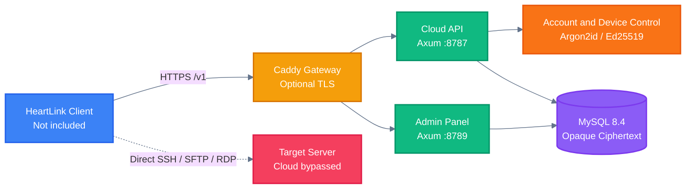

<!-- BEAUTIFIED -->

<p align="center">
  <a href="README.md">中文</a> · English
</p>

<h1 align="center">HeartLink Self-Hosted Cloud</h1>

<p align="center">
  <strong>A self-hosted HeartLink cloud for accounts, device management, and end-to-end ciphertext synchronization.</strong>
  <br />
  <em>Local control · Opaque ciphertext storage · One-command Linux deployment</em>
</p>

<p align="center">
  <a href="#quick-start"></a>
  <a href="LICENSE"></a>
</p>

<p align="center">
  <a href="https://github.com/HEARTHROBXD/HeartLink-Self-Hosted/actions/workflows/ci.yml"></a>
  
  
  
  
</p>

## Features

| Feature | Description |
|---|---|
| Opaque ciphertext sync | Stores versioned ciphertext produced by the client and preserves conflicting revisions. Master passwords, vault keys, and plaintext server credentials are never uploaded. |
| Account and device management | Provides registration, authentication, sessions, device enrollment, revocation, and a separate device-control channel. |
| Administration panel | Uses a dedicated administration port for user, device, recovery, and audit management. |
| Cloud identity verification | Generates an Ed25519 identity during installation and outputs the public key for trusted client enrollment. |
| Optional HTTPS gateway | Uses Caddy and two separate domains to configure TLS for the cloud endpoint and administration panel. |
| Evolvable protocol boundary | Keeps APIs under `/v1`, uses forward-only database migrations, and maintains shared models and sync protocols as separate packages. |

> [!IMPORTANT]
> This repository does not contain the HeartLink desktop client, official-cloud operations modules, or software-update distribution. SSH, SFTP, and RDP traffic connects directly from the client to the target server and never passes through this cloud.

## Quick Start

### Prerequisites

- An `x86_64` or `arm64` Linux host with root access.
- Debian, Ubuntu, RHEL, Rocky Linux, AlmaLinux, CentOS, Fedora, openSUSE, SLES, and Arch Linux are supported.
- Public HTTPS mode also requires two domains that resolve to the host and available ports `80/443`.

### Install for a trusted LAN

```bash
curl -fsSL https://raw.githubusercontent.com/HEARTHROBXD/HeartLink-Self-Hosted/main/install.sh | sudo bash
```

This mode publishes the cloud endpoint to the LAN and binds the administration panel to `127.0.0.1:8789`. Do not expose the LAN HTTP endpoint to the public Internet.

### Install with public HTTPS

```bash
curl -fsSL https://raw.githubusercontent.com/HEARTHROBXD/HeartLink-Self-Hosted/main/install.sh | \
  sudo bash -s -- install \
    --cloud-domain cloud.example.com \
    --panel-domain panel.example.com \
    --email admin@example.com
```

### Save the installation result

When installation completes, the terminal and `/opt/heartlink-cloud/install-result.txt` show the cloud endpoint, panel URL, random administration password, Ed25519 cloud identity public key, and the SSH tunnel command for LAN mode. Only root can read this file.

## Usage

### Check status

```bash
sudo /opt/heartlink-cloud/current/install.sh status
```

### Upgrade atomically

```bash
sudo /opt/heartlink-cloud/current/install.sh upgrade
```

An upgrade builds a new append-only release directory and atomically switches `current`, while preserving database volumes, configuration, and the original cloud identity private key.

### Uninstall

```bash
sudo /opt/heartlink-cloud/current/install.sh uninstall
```

A normal uninstall preserves data. Only the explicit `--purge-data` option permanently removes Docker volumes, identity keys, and configuration.

## Architecture

The client encrypts data before synchronization. The self-hosted service handles authentication, device control, ciphertext revisions, and administration.



## Configuration

The installer writes runtime configuration to `/opt/heartlink-cloud/config/heartlink.env`. The table lists the most commonly used options.

| Variable | Description | Default |
|---|---|---|
| `HEARTLINK_DATABASE_NAME` | MySQL database name. | `heartlink` |
| `HEARTLINK_DATABASE_USER` | MySQL application account. | `heartlink` |
| `HEARTLINK_DATABASE_PASSWORD` | MySQL application password. | Randomly generated |
| `HEARTLINK_PUBLISH_IP` | Published address for the cloud port. HTTPS mode keeps this on loopback. | `0.0.0.0` on LAN |
| `HEARTLINK_PANEL_PUBLISH_IP` | Published address for the administration panel. | `127.0.0.1` |
| `HEARTLINK_REGISTRATION_ENABLED` | Enables new account registration. | `true` |
| `HEARTLINK_RECOVERY_EMAIL_WEBHOOK` | HTTPS webhook for email recovery codes. | Unset |
| `HEARTLINK_RECOVERY_SMS_WEBHOOK` | HTTPS webhook for SMS recovery codes. | Unset |
| `HEARTLINK_RECOVERY_WEBHOOK_TOKEN` | Optional Bearer token for recovery webhooks. | Unset |
| `HEARTLINK_RECOVERY_PEPPER` | Independent random value of at least 32 characters for recovery-code digests. | Randomly generated |

See the [Linux self-hosting guide](docs/SELF_HOSTING_LINUX.md) for complete configuration, 1Panel integration, and backup instructions.

## API

The public protocol is defined in the [OpenAPI 3.1 specification](docs/api/openapi.yaml). Except for health, registration, and login, endpoints require the corresponding Bearer or device-control credential.

| Method | Path | Purpose | Auth |
|---|---|---|---|
| `GET` | `/health` | Check service and protocol versions. | None |
| `POST` | `/v1/auth/register` | Register an account and create a session. | None |
| `POST` | `/v1/auth/login` | Authenticate an account and create a session. | None |
| `DELETE` | `/v1/auth/session` | Revoke the current session. | Bearer |
| `GET / POST` | `/v1/devices` | List or enroll devices. | Bearer |
| `DELETE` | `/v1/devices/{device_id}` | Revoke a device using the account password. | Bearer |
| `GET / POST` | `/v1/devices/{device_id}/control` | Poll or acknowledge device-control commands. | Device-control token |
| `POST` | `/v1/sync/push` | Submit one ciphertext revision or return a conflict. | Bearer |
| `GET` | `/v1/sync/pull` | Incrementally retrieve ciphertext revisions and tombstones. | Bearer |

## Project Structure

```text
.
├── .github/workflows/       # CI configuration
├── apps/server/             # Axum cloud service and admin panel
│   ├── migrations_mysql/    # Forward-only MySQL migrations
│   └── src/                 # API, handshake, and administration logic
├── docs/                    # Deployment, security, OpenAPI, and ADRs
├── infra/docker/            # Compose, Caddy, and 1Panel configuration
├── packages/
│   ├── shared_models/       # Cross-component data models
│   └── sync_protocol/       # Versioned synchronization protocol
├── install.sh               # Linux installation and operations entry point
├── Cargo.toml               # Rust workspace
└── SOURCE_MANIFEST.sha256   # Hash manifest for the public export
```

## Tech Stack

| Layer | Technology | Purpose |
|---|---|---|
| Backend | Rust 2024, Axum 0.8, Tokio | HTTP services, concurrent runtime, and administration panel. |
| Data | SQLx 0.8, MySQL 8.4 | Data access, migrations, and persistence. |
| Security | Argon2id, Ed25519, BLAKE3 | Password verification, cloud identity, and token digests. |
| Infrastructure | Docker Compose, Caddy 2 | Container orchestration, automatic HTTPS, and network isolation. |
| Interface | REST, OpenAPI 3.1 | Versioned `/v1` API and protocol documentation. |
| Validation | Cargo test, Clippy, GitHub Actions | Formatting, static analysis, tests, and image builds. |

## Deployment

The one-command installer pulls source from this repository, builds the self-hosted-only image on the server, and generates independent passwords and identity keys.

- Use the [Docker Compose configuration](infra/docker/compose.yaml) for MySQL, HeartLink, and the optional Caddy gateway.
- Use the [1Panel configuration](infra/docker/compose.1panel.yaml) with an existing MySQL container and Docker network.
- Use [GitHub Actions](.github/workflows/ci.yml) to validate formatting, Clippy, tests, Docker builds, and the public-source boundary.
- Read the [security policy](SECURITY.md) before production deployment, and back up `/opt/heartlink-cloud/secrets`, configuration, and Docker volumes.

## Contributing

1. Fork the repository and create a feature branch from `main`.
2. Follow the [contribution guide](CONTRIBUTING.md), preserve protocol compatibility, and add tests for behavior changes.
3. Run the validation commands:

   ```bash
   cargo fmt --all -- --check
   cargo clippy -p heartlink-server --no-default-features --features self-hosted --all-targets -- -D warnings
   cargo test -p heartlink-server --no-default-features --features self-hosted
   docker build -f apps/server/Dockerfile .
   ```

4. Commit the changes and open a Pull Request. Never commit real hosts, credentials, private keys, access tokens, or production ciphertext.

## License

The root repository is licensed under [AGPL-3.0-only](LICENSE). Shared models and the synchronization protocol use `Apache-2.0`, while documentation uses `CC-BY-4.0`; see the [component license notes](LICENSES/README.md) for directory-level boundaries.
