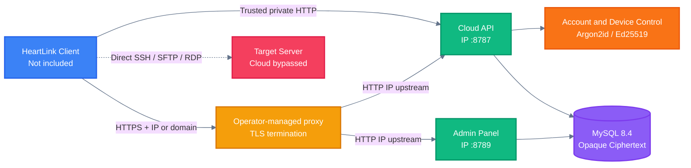

<!-- BEAUTIFIED -->

<p align="center">
  <a href="README.md">中文</a> · English
</p>

<h1 align="center">HeartLink Self-Hosted Cloud</h1>

<p align="center">
  <strong>A self-hosted HeartLink cloud for accounts, device management, and end-to-end ciphertext synchronization.</strong>
  <br />
  <em>Local control · Opaque ciphertext storage · One-command Linux deployment</em>
</p>

<p align="center">
  <a href="https://heartlink.hearthrob.cn/"></a>
  <a href="https://heartlink.hearthrob.cn/#download"></a>
</p>

<p align="center">
  <a href="#quick-start"></a>
  <a href="LICENSE"></a>
</p>

<p align="center">
  <a href="https://github.com/HEARTHROBXD/HeartLink-Self-Hosted/actions/workflows/ci.yml"></a>
  
  
  
  
</p>

## Features

| Feature | Description |
|---|---|
| Opaque ciphertext sync | Stores versioned ciphertext produced by the client and preserves conflicting revisions. Master passwords, vault keys, and plaintext server credentials are never uploaded. |
| Account and device management | Provides registration, authentication, sessions, device enrollment, revocation, and a separate device-control channel. |
| Administration panel | Uses a dedicated administration port for user, device, recovery, and audit management. |
| Cloud identity verification | Generates an Ed25519 identity during installation and outputs the public key for trusted client enrollment. |
| Unified IP endpoints | Publishes the cloud API and administration panel on configurable IPv4 addresses; domains, certificates, and reverse proxies are fully operator-managed. |
| Evolvable protocol boundary | Keeps APIs under `/v1`, uses forward-only database migrations, and maintains shared models and sync protocols as separate packages. |

> [!IMPORTANT]
> This repository does not contain the HeartLink desktop client, official-cloud operations modules, or software-update distribution. SSH, SFTP, and RDP traffic connects directly from the client to the target server and never passes through this cloud.

> [!TIP]
> Looking for the HeartLink client? Visit the [official HeartLink website](https://heartlink.hearthrob.cn/) for product information, then open the [client download section](https://heartlink.hearthrob.cn/#download) for the current Windows x64 preview. The website lists the latest availability for other platforms.

## Quick Start

### Prerequisites

- An `x86_64` or `arm64` Linux host with root access.
- Debian, Ubuntu, RHEL, Rocky Linux, AlmaLinux, CentOS, Fedora, openSUSE, SLES, and Arch Linux are supported.
- Configure the host firewall before exposing the service. HTTPS requires an operator-managed reverse proxy and a trusted certificate matching the selected IP address or domain.

### Install

```bash
curl -fsSL https://raw.githubusercontent.com/HEARTHROBXD/HeartLink-Self-Hosted/main/install.sh | sudo bash
```

The installer pulls the official prebuilt image directly. It does not install Rust or compile on this server; first-run time is dominated by downloading Docker, HeartLink, and MySQL images.

The default path pulls the immutable digest from GHCR first. If a mainland China network cannot download GHCR layers, the installer retries the exact same digest through Nanjing University's public mirror. Digest verification remains mandatory, so different image content is never accepted. An explicit `--server-image` or `HEARTLINK_SERVER_IMAGE` override is respected and never replaced automatically.

The installer does not distinguish between LAN and Internet deployment, and it does not request domains or certificates. By default, the cloud API and administration panel are published on every IPv4 interface:

```text
http://SERVER_IP:8787
http://SERVER_IP:8789
```

The TCP mapping for `8789` is published normally, but the administration application accepts only loopback, LAN/private sources, or a same-host reverse proxy. A direct request from a public source returns `403`; that is an application security policy, not a failed port mapping. Use a trusted HTTPS reverse proxy or the SSH tunnel printed by the installer for public administration.

To restrict either service to a specific interface, provide its IPv4 address during installation or upgrade:

```bash
curl -fsSL https://raw.githubusercontent.com/HEARTHROBXD/HeartLink-Self-Hosted/main/install.sh | \
  sudo bash -s -- install \
    --publish-ip 192.168.1.20 \
    --panel-publish-ip 192.168.1.20
```

### Configure HTTPS

Operators manage HTTPS and domains independently. A reverse proxy may expose an IP address or a domain and forward traffic to the same IP upstreams: `http://SERVER_IP:8787` for the cloud API and `http://SERVER_IP:8789` for the administration panel. When using `https://IP`, the certificate must contain that IP in its Subject Alternative Name and be trusted by the client system; the client never bypasses certificate validation.

### Save the installation result

The installer waits for a successful cloud API health check on `8787` and an HTTP response from the administration listener on `8789`; it writes the completion marker only after both listeners work. When installation completes, the terminal and `/opt/heartlink-cloud/install-result.txt` show IP-based cloud and panel URLs, the random administration password, the Ed25519 cloud identity public key, an optional SSH tunnel command, and the HTTPS upstream addresses. Only root can read this file.

After installation, always manage the service through `/opt/heartlink-cloud/install.sh`. The installer creates this stable entry point with mode `0755`, independently of whether an archive or Git checkout preserved executable metadata.

## Usage

### Check status

```bash
sudo /opt/heartlink-cloud/install.sh status
```

`status` lists running and stopped containers and probes both `8787` and `8789`. An unhealthy service returns a non-zero status and prints container state plus recent logs instead of treating container creation as availability.

### Upgrade atomically

```bash
sudo /opt/heartlink-cloud/install.sh upgrade
```

An upgrade creates a new append-only release directory, pulls the official prebuilt image, and atomically switches `current`, while preserving database volumes, configuration, and the original cloud identity private key. No Rust compilation runs on the user's server.

### Uninstall

```bash
sudo /opt/heartlink-cloud/install.sh uninstall
```

A normal uninstall removes the containers and installed state while preserving database volumes, identity keys, configuration, and release files. Running `install` again reuses that preserved data; repeating a normal uninstall succeeds with an already-uninstalled message. `status` explicitly reports the preserved-data state. Only the explicit `--purge-data` option permanently removes Docker volumes, identity keys, configuration, and installation files.

### Recover from a failed installation

The installer marks HeartLink as installed only after the prebuilt-image pull, identity-key generation, and service startup all succeed. If any step fails, existing data and generated secrets are preserved. Run:

```bash
sudo /opt/heartlink-cloud/install.sh status
sudo /opt/heartlink-cloud/install.sh reinstall
```

`reinstall` downloads the lightweight release files and pulls the selected prebuilt image again without clearing database volumes or identity keys. A failed upgrade restores the previous release pointer and runtime configuration so `start` can resume the prior version; `stop` stops services without deleting data. `status` and `uninstall` also remain available when the first installation failed before a complete Compose runtime was created.

For installer `1.2.0` and earlier, if `/opt/heartlink-cloud/current/install.sh: command not found` appears, invoke the old file through Bash to bypass its missing executable bit, then repair the stable entry point and runtime health with the current installer:

```bash
sudo bash /opt/heartlink-cloud/current/install.sh status
curl -fsSL https://raw.githubusercontent.com/HEARTHROBXD/HeartLink-Self-Hosted/main/install.sh | \
  sudo bash -s -- reinstall
```

The repair preserves database volumes, runtime configuration, and the cloud identity key. Do not delete `/opt/heartlink-cloud` or Docker volumes as a recovery shortcut.

## Architecture

The client encrypts data before synchronization. The self-hosted service handles authentication, device control, ciphertext revisions, and administration.



## Configuration

The installer writes runtime configuration to `/opt/heartlink-cloud/.env`. The table lists the most commonly used options.

| Variable | Description | Default |
|---|---|---|
| `HEARTLINK_DATABASE_NAME` | MySQL database name. | `heartlink` |
| `HEARTLINK_DATABASE_USER` | MySQL application account. | `heartlink` |
| `HEARTLINK_DATABASE_PASSWORD` | MySQL application password. | Randomly generated |
| `HEARTLINK_SERVER_IMAGE` | Official multi-architecture HeartLink image; the default is digest-pinned and uses a same-digest mainland mirror if GHCR fails. Explicit overrides are never replaced. | Current pinned `1.4.0` digest |
| `HEARTLINK_MYSQL_IMAGE` | MySQL runtime image; override it with the installer's `--mysql-image` option. | `mysql:8.4.10` |
| `HEARTLINK_PUBLISH_IP` | IPv4 publish address for cloud port `8787`; `0.0.0.0` selects every IPv4 interface. | `0.0.0.0` |
| `HEARTLINK_PANEL_PUBLISH_IP` | IPv4 publish address for panel port `8789`; set a specific interface or `127.0.0.1` when required. | `0.0.0.0` |
| `HEARTLINK_REGISTRATION_ENABLED` | Enables new account registration. | `true` |
| `HEARTLINK_RECOVERY_EMAIL_WEBHOOK` | HTTPS webhook for email recovery codes. | Unset |
| `HEARTLINK_RECOVERY_SMS_WEBHOOK` | HTTPS webhook for SMS recovery codes. | Unset |
| `HEARTLINK_RECOVERY_WEBHOOK_TOKEN` | Optional Bearer token for recovery webhooks. | Unset |
| `HEARTLINK_RECOVERY_PEPPER` | Independent random value of at least 32 characters for recovery-code digests. | Randomly generated |

See the [Linux self-hosting guide](docs/SELF_HOSTING_LINUX.md) for complete configuration, 1Panel integration, and backup instructions.

## API

The public protocol is defined in the [OpenAPI 3.1 specification](docs/api/openapi.yaml). Except for health, registration, and login, endpoints require the corresponding Bearer or device-control credential.

| Method | Path | Purpose | Auth |
|---|---|---|---|
| `GET` | `/health` | Check service and protocol versions. | None |
| `POST` | `/v1/auth/register` | Register an account and create a session. | None |
| `POST` | `/v1/auth/login` | Authenticate an account and create a session. | None |
| `DELETE` | `/v1/auth/session` | Revoke the current session. | Bearer |
| `GET / POST` | `/v1/devices` | List or enroll devices. | Bearer |
| `DELETE` | `/v1/devices/{device_id}` | Revoke a device using the account password. | Bearer |
| `GET / POST` | `/v1/devices/{device_id}/control` | Poll or acknowledge device-control commands. | Device-control token |
| `POST` | `/v1/sync/push` | Submit one ciphertext revision or return a conflict. | Bearer |
| `GET` | `/v1/sync/pull` | Incrementally retrieve ciphertext revisions and tombstones. | Bearer |

## Project Structure

```text
.
├── .github/workflows/       # CI configuration
├── apps/server/             # Axum cloud service and admin panel
│   ├── migrations_mysql/    # Forward-only MySQL migrations
│   └── src/                 # API, handshake, and administration logic
├── docs/                    # Deployment, security, OpenAPI, and ADRs
├── infra/docker/            # Compose and 1Panel configuration
├── packages/
│   ├── shared_models/       # Cross-component data models
│   └── sync_protocol/       # Versioned synchronization protocol
├── install.sh               # Linux installation and operations entry point
├── Cargo.toml               # Rust workspace
└── SOURCE_MANIFEST.sha256   # Hash manifest for the public export
```

## Tech Stack

| Layer | Technology | Purpose |
|---|---|---|
| Backend | Rust 2024, Axum 0.8, Tokio | HTTP services, concurrent runtime, and administration panel. |
| Data | SQLx 0.8, MySQL 8.4 | Data access, migrations, and persistence. |
| Security | Argon2id, Ed25519, BLAKE3 | Password verification, cloud identity, and token digests. |
| Infrastructure | Docker Compose | Container orchestration, port publishing, and database network isolation. |
| Interface | REST, OpenAPI 3.1 | Versioned `/v1` API and protocol documentation. |
| Validation | Cargo test, Clippy, GitHub Actions | Formatting, static analysis, tests, and image builds. |

## Deployment

The one-command installer downloads only lightweight release files plus the official prebuilt `amd64`/`arm64` image, then generates independent passwords and identity keys locally. It does not install a Rust toolchain or run `cargo build` or a Docker image build on the user's server.

- Use the [Docker Compose configuration](infra/docker/compose.yaml) for MySQL and HeartLink. MySQL stays only on the internal database network, while HeartLink also joins a routable edge network so Docker 29 and similar releases actually publish `8787`/`8789` without exposing `3306`.
- Use the [1Panel configuration](infra/docker/compose.1panel.yaml) with an existing MySQL container and Docker network.
- Domains, WAFs, TLS certificates, and reverse proxies are outside the installer boundary. Operators may use Nginx, Caddy, 1Panel, SafeLine, or another gateway with IP upstreams.
- The official repository uses the [image publishing workflow](.github/workflows/publish-image.yml) to build multi-architecture images centrally, while [GitHub Actions](.github/workflows/ci.yml) validates formatting, Clippy, tests, Compose configuration, and the public-source boundary.
- Read the [security policy](SECURITY.md) before production deployment, and back up `/opt/heartlink-cloud/secrets`, configuration, and Docker volumes.

## Contributing

1. Fork the repository and create a feature branch from `main`.
2. Follow the [contribution guide](CONTRIBUTING.md), preserve protocol compatibility, and add tests for behavior changes.
3. Run the validation commands:

   ```bash
   cargo fmt --all -- --check
   cargo clippy -p heartlink-server --no-default-features --features self-hosted --all-targets -- -D warnings
   cargo test -p heartlink-server --no-default-features --features self-hosted
   docker build -f apps/server/Dockerfile .
   ```

4. Commit the changes and open a Pull Request. Never commit real hosts, credentials, private keys, access tokens, or production ciphertext.

## License

The root repository is licensed under [AGPL-3.0-only](LICENSE). Shared models and the synchronization protocol use `Apache-2.0`, while documentation uses `CC-BY-4.0`; see the [component license notes](LICENSES/README.md) for directory-level boundaries.
