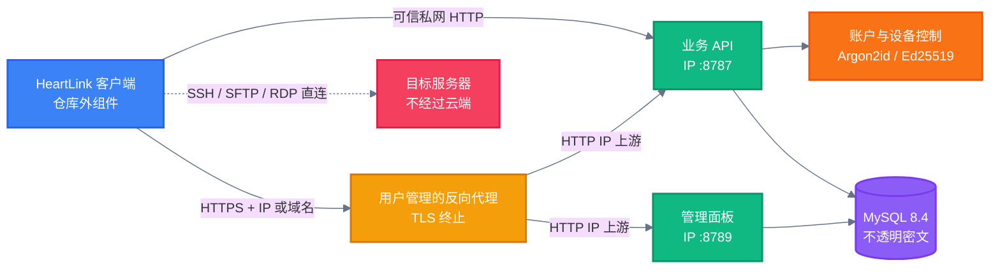

<!-- BEAUTIFIED -->

<p align="center">
  中文 · <a href="README.en.md">English</a>
</p>

<h1 align="center">HeartLink Self-Hosted Cloud</h1>

<p align="center">
  <strong>用于账户、设备管理与端到端密文同步的 HeartLink 自部署云端。</strong>
  <br />
  <em>本地掌控 · 不透明密文存储 · Linux 一键部署</em>
</p>

<p align="center">
  <a href="https://heartlink.hearthrob.cn/"></a>
  <a href="https://heartlink.hearthrob.cn/#download"></a>
</p>

<p align="center">
  <a href="#快速开始"></a>
  <a href="LICENSE"></a>
</p>

<p align="center">
  <a href="https://github.com/HEARTHROBXD/HeartLink-Self-Hosted/actions/workflows/ci.yml"></a>
  
  
  
  
</p>

## 功能特性

| 功能 | 说明 |
|---|---|
| 不透明密文同步 | 服务端保存客户端生成的版本化密文，并保留冲突版本；主密码、Vault 密钥和服务器明文凭据不会上传。 |
| 账户与设备管理 | 提供注册、认证、会话、设备登记、吊销和独立设备控制通道。 |
| 管理面板 | 单独的管理端口用于用户、设备、找回设置和审计管理。 |
| 云端身份校验 | 安装时生成 Ed25519 身份密钥，并输出需要通过可信渠道录入客户端的公钥。 |
| 统一 IP 端点 | 业务 API 和管理面板始终发布到可配置 IPv4 地址；域名、证书和反向代理完全由部署者管理。 |
| 可演进的协议边界 | API 固定在 `/v1`，数据库迁移只前进，共享模型与同步协议作为独立包维护。 |

> [!IMPORTANT]
> 本仓库不包含 HeartLink 桌面客户端、官方云运营模块或软件更新下发功能。SSH、SFTP 和 RDP 流量由客户端直连目标服务器，不经过本云端。

> [!TIP]
> 需要 HeartLink 客户端？访问 [HeartLink 官网](https://heartlink.hearthrob.cn/)了解产品，并前往[客户端下载区](https://heartlink.hearthrob.cn/#download)获取当前 Windows x64 预览版。其他平台的开放状态以官网为准。

## 快速开始

### 前置条件

- 一台 `x86_64` 或 `arm64` Linux 主机，并具有 root 权限。
- 支持 Debian、Ubuntu、RHEL、Rocky Linux、AlmaLinux、CentOS、Fedora、openSUSE、SLES 和 Arch Linux。
- 对外开放前，请配置主机防火墙；需要 HTTPS 时，请自行准备反向代理和与 IP 或域名匹配的受信任证书。

### 安装

```bash
curl -fsSL https://raw.githubusercontent.com/HEARTHROBXD/HeartLink-Self-Hosted/main/install.sh | sudo bash
```

安装器会直接拉取官方预编译镜像，不会在这台服务器上安装 Rust 或现场编译；首次运行的主要耗时是 Docker、HeartLink 和 MySQL 镜像下载。

安装器不区分局域网或公网，也不申请域名和证书。默认将业务 API 与管理面板发布到所有 IPv4 接口：

```text
http://SERVER_IP:8787
http://SERVER_IP:8789
```

`8789` 的 TCP 映射会正常发布，但管理应用只接受回环、局域网/私网来源或同机反向代理；公网来源直接访问会返回 `403`。这是应用层安全限制，不表示端口映射失败。公网管理请使用受信任的 HTTPS 反向代理或安装结果中给出的 SSH 隧道。

如需限定监听网卡，可在首次安装或升级时指定地址：

```bash
curl -fsSL https://raw.githubusercontent.com/HEARTHROBXD/HeartLink-Self-Hosted/main/install.sh | \
  sudo bash -s -- install \
    --publish-ip 192.168.1.20 \
    --panel-publish-ip 192.168.1.20
```

### 配置 HTTPS

HTTPS 与域名由用户自行配置。反向代理可以使用 IP 或域名作为外部地址，并将请求转发到相同的 IP 上游：业务 API 为 `http://SERVER_IP:8787`，管理面板为 `http://SERVER_IP:8789`。使用 `https://IP` 时，证书必须包含对应 IP 的 Subject Alternative Name，并受到客户端系统信任；客户端不会跳过证书验证。

### 保存安装结果

安装器会等待业务 API `8787` 的健康检查和管理面板 `8789` 的 HTTP 响应；两个监听都可用后才会写入“安装完成”标记。安装结束时，终端和 `/opt/heartlink-cloud/install-result.txt` 会显示基于 IP 的云端地址、面板地址、随机管理密码、云端 Ed25519 身份公钥、可选 SSH 隧道命令和 HTTPS 上游地址。该文件仅允许 root 读取。

安装后固定使用 `/opt/heartlink-cloud/install.sh` 管理服务。安装器会以 `0755` 权限创建这个稳定入口，不依赖归档或 Git 是否保留可执行位。

## 使用方法

### 查看状态

```bash
sudo /opt/heartlink-cloud/install.sh status
```

`status` 会列出运行中和已停止的容器，并实际探测 `8787`/`8789`。若服务不健康，它会返回非零状态，同时输出容器状态和最近日志，不会把“容器已创建”误报为可用。

### 原子升级

```bash
sudo /opt/heartlink-cloud/install.sh upgrade
```

升级会创建新的只增版本目录、拉取官方预编译镜像并原子切换 `current`，保留数据库卷、配置和原云端身份私钥。用户服务器不会运行 Rust 编译。

### 卸载

```bash
sudo /opt/heartlink-cloud/install.sh uninstall
```

普通卸载移除容器和“已安装”状态，但保留数据库卷、身份密钥、配置和 release 文件。此后可以直接再次运行 `install`；重复执行普通卸载会成功返回“已经卸载”。`status` 会明确显示“已卸载但数据保留”。只有显式添加 `--purge-data` 才会永久删除 Docker 数据卷、身份密钥、配置和安装文件。

### 安装失败后的恢复

安装器只有在预编译镜像拉取、身份密钥生成和服务启动全部成功后才写入“已安装”状态。若中途失败，数据和已生成的密钥会保留，并可直接执行：

```bash
sudo /opt/heartlink-cloud/install.sh status
sudo /opt/heartlink-cloud/install.sh reinstall
```

`reinstall` 会重新下载轻量发布文件并拉取当前预编译镜像，但不会清除数据库卷或身份密钥。失败升级会恢复先前的版本指针和运行配置，可使用 `start` 重新启动旧版本；`stop` 可停止服务而不删除数据。即使首次安装尚未生成完整的 Compose 文件，`status` 与 `uninstall` 也不会再被半安装状态锁死。

如果是安装器 `1.2.0` 或更早版本，并遇到 `/opt/heartlink-cloud/current/install.sh: command not found`，先用 Bash 绕过旧归档缺失的可执行位，再用最新安装器修复稳定管理入口和服务健康状态：

```bash
sudo bash /opt/heartlink-cloud/current/install.sh status
curl -fsSL https://heartlink.hearthrob.cn/HEARTHROBXD/HeartLink-Self-Hosted/main/install.sh | \
  sudo bash -s -- reinstall
```

修复不会清空数据库卷、运行配置或云身份密钥。不要为了恢复服务直接删除 `/opt/heartlink-cloud` 或 Docker 数据卷。

## 架构

客户端加密数据后再同步；自部署服务只负责身份验证、设备控制、密文版本和管理操作。



## 配置

一键安装器会在 `/opt/heartlink-cloud/.env` 生成运行配置。下表列出最常用的选项。

| 变量 | 说明 | 默认值 |
|---|---|---|
| `HEARTLINK_DATABASE_NAME` | MySQL 数据库名。 | `heartlink` |
| `HEARTLINK_DATABASE_USER` | MySQL 应用账户。 | `heartlink` |
| `HEARTLINK_DATABASE_PASSWORD` | MySQL 应用账户密码。 | 安装器随机生成 |
| `HEARTLINK_SERVER_IMAGE` | HeartLink 官方多架构预编译镜像；安装器默认锁定到不可变摘要。 | 当前 `1.4.0` 固定摘要 |
| `HEARTLINK_MYSQL_IMAGE` | MySQL 运行镜像；可通过安装器的 `--mysql-image` 覆盖。 | `mysql:8.4.10` |
| `HEARTLINK_PUBLISH_IP` | 业务端口 `8787` 的 IPv4 发布地址；`0.0.0.0` 表示所有 IPv4 接口。 | `0.0.0.0` |
| `HEARTLINK_PANEL_PUBLISH_IP` | 管理面板端口 `8789` 的 IPv4 发布地址；可设为指定网卡或 `127.0.0.1`。 | `0.0.0.0` |
| `HEARTLINK_REGISTRATION_ENABLED` | 是否允许新账户注册。 | `true` |
| `HEARTLINK_RECOVERY_EMAIL_WEBHOOK` | 邮箱验证码发送服务的 HTTPS webhook。 | 未设置 |
| `HEARTLINK_RECOVERY_SMS_WEBHOOK` | 短信验证码发送服务的 HTTPS webhook。 | 未设置 |
| `HEARTLINK_RECOVERY_WEBHOOK_TOKEN` | 找回 webhook 使用的可选 Bearer token。 | 未设置 |
| `HEARTLINK_RECOVERY_PEPPER` | 找回验证码摘要的独立随机值，至少 32 个字符。 | 安装器随机生成 |

完整配置、1Panel 接入和备份说明见 [Linux 自部署指南](docs/SELF_HOSTING_LINUX.md)。

## API

公开协议定义位于 [OpenAPI 3.1 文档](docs/api/openapi.yaml)。除健康检查和注册/登录外，接口均需要对应的 Bearer 或设备控制凭据。

| 方法 | 路径 | 用途 | 认证 |
|---|---|---|---|
| `GET` | `/health` | 检查服务与协议版本。 | 无 |
| `POST` | `/v1/auth/register` | 注册账户并创建会话。 | 无 |
| `POST` | `/v1/auth/login` | 验证账户并创建会话。 | 无 |
| `DELETE` | `/v1/auth/session` | 吊销当前会话。 | Bearer |
| `GET / POST` | `/v1/devices` | 查询或登记设备。 | Bearer |
| `DELETE` | `/v1/devices/{device_id}` | 使用账户密码吊销设备。 | Bearer |
| `GET / POST` | `/v1/devices/{device_id}/control` | 轮询或确认设备控制命令。 | 设备控制 token |
| `POST` | `/v1/sync/push` | 提交一个密文版本或返回冲突。 | Bearer |
| `GET` | `/v1/sync/pull` | 增量拉取密文版本和 tombstone。 | Bearer |

## 项目结构

```text
.
├── .github/workflows/       # CI 配置
├── apps/server/             # Axum 云端与管理面板
│   ├── migrations_mysql/    # MySQL 前进迁移
│   └── src/                 # API、握手和管理逻辑
├── docs/                    # 部署、安全模型、OpenAPI 与 ADR
├── infra/docker/            # Compose 与 1Panel 配置
├── packages/
│   ├── shared_models/       # 跨组件数据模型
│   └── sync_protocol/       # 版本化同步协议
├── install.sh               # Linux 一键安装与运维入口
├── Cargo.toml               # Rust workspace
└── SOURCE_MANIFEST.sha256   # 公开导出的文件哈希清单
```

## 技术栈

| 层级 | 技术 | 用途 |
|---|---|---|
| 后端 | Rust 2024、Axum 0.8、Tokio | HTTP 服务、并发运行时和管理面板。 |
| 数据 | SQLx 0.8、MySQL 8.4 | 数据访问、迁移和持久化。 |
| 安全 | Argon2id、Ed25519、BLAKE3 | 密码验证、云端身份和 token 摘要。 |
| 基础设施 | Docker Compose | 容器编排、端口发布和数据库网络隔离。 |
| 接口 | REST、OpenAPI 3.1 | `/v1` 版本化 API 与协议文档。 |
| 验证 | Cargo test、Clippy、GitHub Actions | 格式、静态检查、测试和镜像构建。 |

## 部署

一键安装器只下载轻量发布文件及官方预编译的 `amd64`/`arm64` 镜像，并在本机生成独立密码和身份密钥；用户服务器不安装 Rust 工具链，也不执行 `cargo build` 或 Docker 镜像构建。

- 使用 [Docker Compose 配置](infra/docker/compose.yaml)部署 MySQL 和 HeartLink 服务；MySQL 只接入内部数据库网络，HeartLink 额外接入可路由的边缘网络，确保 Docker 29 等版本能真正发布 `8787`/`8789`，同时不暴露 `3306`。
- 使用 [1Panel 配置](infra/docker/compose.1panel.yaml)接入已有的 MySQL 容器和 Docker 网络。
- 域名、WAF、TLS 证书和反向代理不属于安装器职责；用户可以选择 Nginx、Caddy、1Panel、雷池或其他网关，并使用 IP 上游。
- 官方仓库使用 [镜像发布工作流](.github/workflows/publish-image.yml)集中构建多架构镜像，并使用 [GitHub Actions](.github/workflows/ci.yml)验证格式、Clippy、测试、Compose 配置和公开边界。
- 生产部署前阅读 [安全策略](SECURITY.md)，备份 `/opt/heartlink-cloud/secrets`、配置文件和 Docker 数据卷。

## 贡献

1. Fork 仓库并从 `main` 创建功能分支。
2. 按 [贡献指南](CONTRIBUTING.md)保持协议兼容，并为行为变更添加测试。
3. 运行以下验证：

   ```bash
   cargo fmt --all -- --check
   cargo clippy -p heartlink-server --no-default-features --features self-hosted --all-targets -- -D warnings
   cargo test -p heartlink-server --no-default-features --features self-hosted
   docker build -f apps/server/Dockerfile .
   ```

4. 提交变更并发起 Pull Request。不要提交真实主机、凭据、私钥、访问 token 或生产密文。

## 许可证

根仓库许可证为 [AGPL-3.0-only](LICENSE)。共享模型与同步协议使用 `Apache-2.0`，文档使用 `CC-BY-4.0`；各目录的具体边界见 [组件许可证说明](LICENSES/README.md)。
